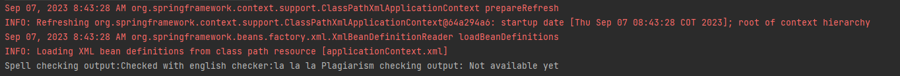
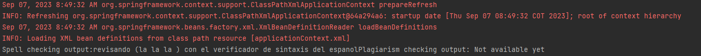

# Escuela Colombiana de Ingeniería
# Arquitecturas de Software - ARSW
### Taller – Principio de Inversión de dependencias, Contenedores Livianos e Inyección de dependencias.

Parte I. Ejercicio básico.

Para ilustrar el uso del framework Spring, y el ambiente de desarrollo para el uso del mismo a través de Maven (y NetBeans), se hará la configuración de una aplicación de análisis de textos, que hace uso de un verificador gramatical que requiere de un corrector ortográfico. A dicho verificador gramatical se le inyectará, en tiempo de ejecución, el corrector ortográfico que se requiera (por ahora, hay dos disponibles: inglés y español).

1. __Abra el los fuentes del proyecto en NetBeans.__

2. __Revise el archivo de configuración de Spring ya incluido en el proyecto (src/main/resources). El mismo indica que Spring buscará automáticamente los 'Beans' disponibles en el paquete indicado.__

3. __Haciendo uso de la [configuración de Spring basada en anotaciones](https://docs.spring.io/spring-boot/docs/current/reference/html/using-boot-spring-beans-and-dependency-injection.html) marque con las anotaciones @Autowired y @Service las dependencias que deben inyectarse, y los 'beans' candidatos a ser inyectadas -respectivamente-:__

	* __GrammarChecker será un bean, que tiene como dependencia algo de tipo 'SpellChecker'.__  
   Se agrega la anotación @Component para indicar que GrammarChecker es un Bean. Además, se agrega la @Autowired en el método que va a inyectar la dependencia del corrector ortográfico.  
   
    * __EnglishSpellChecker y SpanishSpellChecker son los dos posibles candidatos a ser inyectados. Se debe seleccionar uno, u otro, mas NO ambos (habría conflicto de resolución de dependencias). Por ahora haga que se use EnglishSpellChecker.__  
   A cada una de estas se les agrega la anotación de @Service, para indicar que estos son las dependencias disponibles a ser inyectadas. Para hacer que se use EnglishSpellChecker, usamos @Primary.  
   
 
5.	Haga un programa de prueba, donde se cree una instancia de GrammarChecker mediante Spring, y se haga uso de la misma:

	```java
	public static void main(String[] args) {
		ApplicationContext ac=new ClassPathXmlApplicationContext("applicationContext.xml");
		GrammarChecker gc=ac.getBean(GrammarChecker.class);
		System.out.println(gc.check("la la la "));
	}
	```

  
Como se observa, se utilizó el corrector gramático de ingles.
6.	Modifique la configuración con anotaciones para que el Bean ‘GrammarChecker‘ ahora haga uso del  la clase SpanishSpellChecker (para que a GrammarChecker se le inyecte EnglishSpellChecker en lugar de  SpanishSpellChecker. Verifique el nuevo resultado.  
  
Colocando la anotación @Primary ahora en el corrector ortográfico de español, se inyecta en GrammarChecker.
